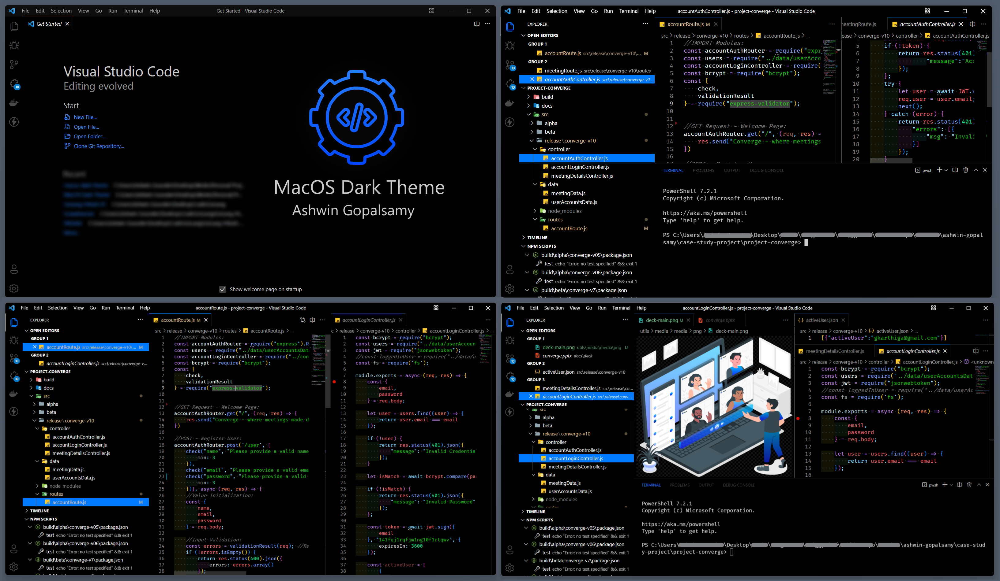

# [MacOS Dark Theme](https://marketplace.visualstudio.com/items?itemName=ashwingopalsamy.macos-dark-theme)

## [GitHub Repo](https://github.com/ashwin2125/macos-dark-theme) 

Simple and Absolute Dark Theme Extension with Apple's Iconic Blue - `#007aff`, for VSCode.

[](https://github.com/ashwin2125/macos-dark-theme) 
[](https://vscode.dev/theme/ashwingopalsamy.macos-dark-theme) [](https://marketplace.visualstudio.com/items?itemName=ashwingopalsamy.macos-dark-theme) [](https://marketplace.visualstudio.com/items?itemName=ashwingopalsamy.macos-dark-theme) [](https://marketplace.visualstudio.com/items?itemName=ashwingopalsamy.macos-dark-theme)



### Install

press `ctl/command + p` to launch quick open then run
```
ext install macos-dark-theme
```

### Suggest Editor Settings
```
 "editor.fontSize": 20,
 "editor.lineHeight": 30,
 "editor.fontFamily": "Fira Code, Consolas",
 "editor.fontLigatures": true
```

Fira Code Download: https://fonts.google.com/specimen/Fira+Code <br>
JetBrains Mono Download: https://www.jetbrains.com/lp/mono

### Tweaks & theming

If you want to play around with new colors, use the setting
`workbench.colorCustomizations` to customize the currently selected theme. For
example, you can add this snippet in your "settings.json" file:

```json
"workbench.colorCustomizations": {
  "workbench.iconTheme": "material-icon-theme",
  "editor.cursorBlinking": "expand",
  "editor.cursorSmoothCaretAnimation": true,
  "editor.mouseWheelZoom": true
}
```
or use the setting `editor.tokenColorCustomizations`

---

### Backstory

I've always searched for a better color theme that would be absolutely dark and tidy. I wasn't able to find any, that suited my personal taste. Then came the thought  _"Why not just create and publish one, Ashwin?"_

Andddd, thats where **"MacOS Dark Theme"** came into existence. 

I request everyone to try the theme, hope you all like it.

தமிழ் வாழ்க ❤️

### Publisher - Social Links

[](https://linkedin.com/in/ashwin2125)
[](https://github.com/ashwin2125)
[](https://ashwxn.codes)
